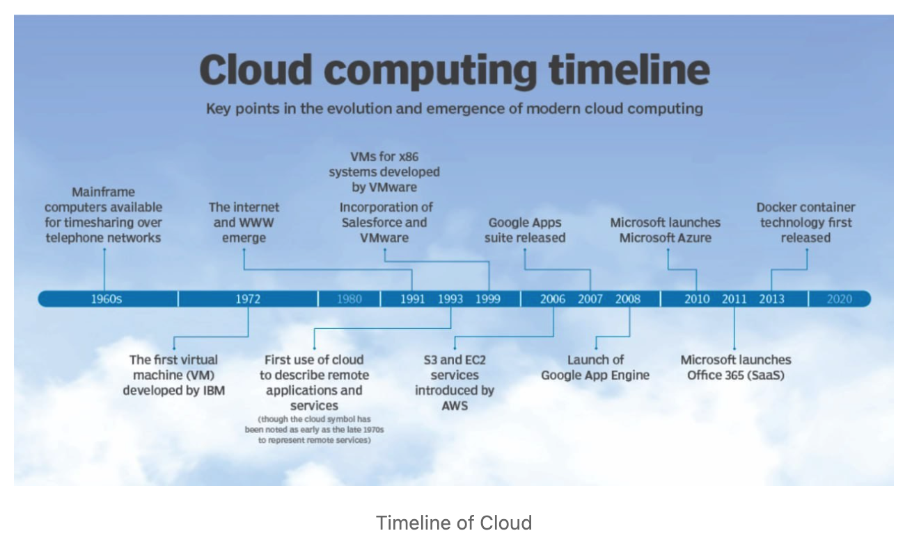
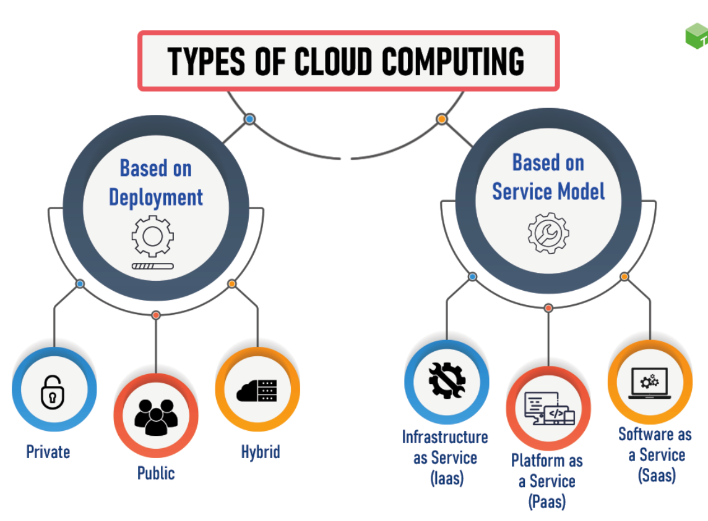
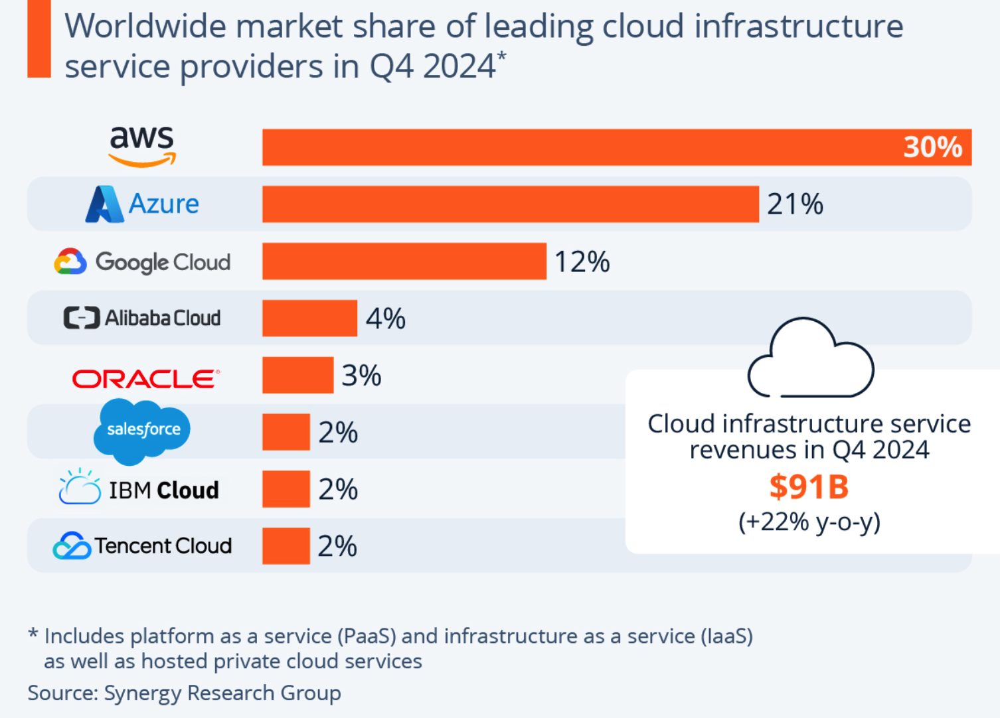
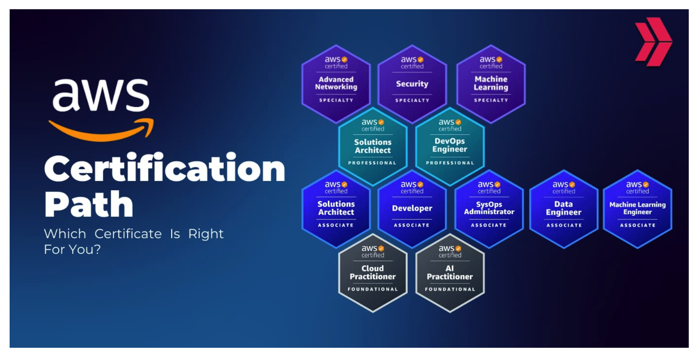
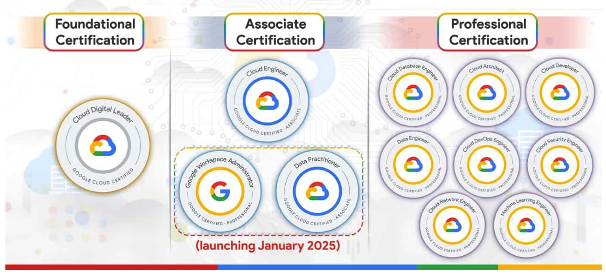
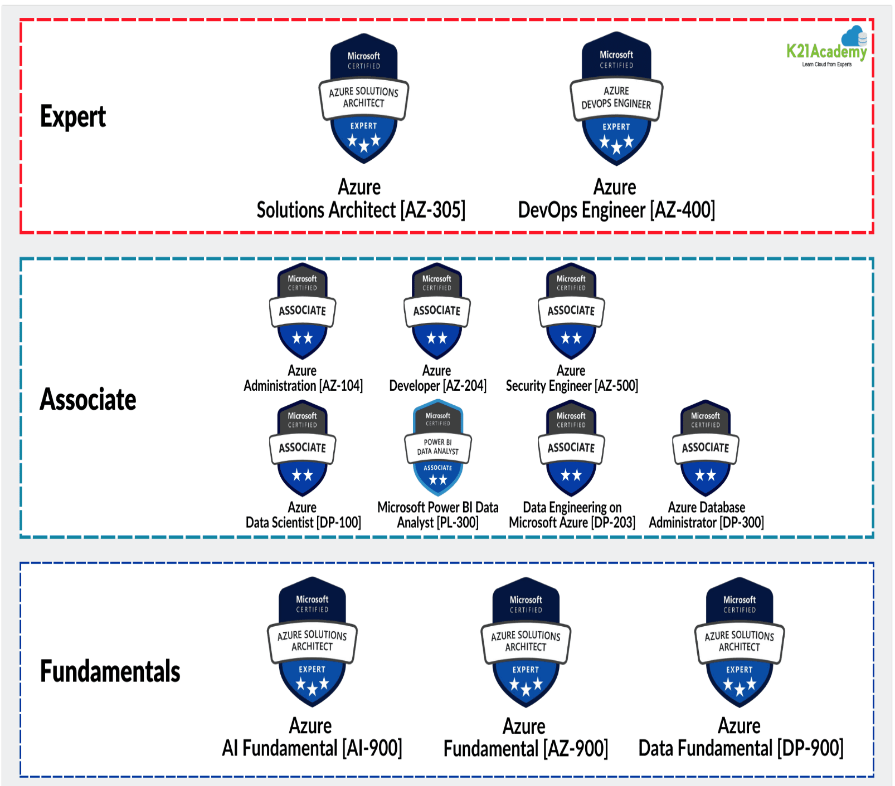

# Cloud Concepts
## The cloud—what is it?
Simply, Cloud is on-demand access to computing resources over the internet, such as servers, storage, databases, networking, software, and more—without the need to own or manage physical hardware.

## Cloud - Timeline

The concept of cloud computing can trace its origins back to the 1950s and 1960s, a time when mainframe computers dominated the computing landscape. These powerful machines, housed in large, air-conditioned rooms, were far too expensive and complex for individual ownership. Instead, organisations used time-sharing systems to maximise their investments.

Time-sharing allows multiple users to share the computing power of a single mainframe simultaneously. This was a revolutionary idea, making computing accessible and affordable for many more users. IBM and MIT’s Compatible Time-Sharing System (CTSS), developed in the early 1960s, was one of the first implementations of this concept, allowing multiple terminals to connect to a central mainframe.

J.C.R. Licklider, an American computer scientist, is often credited with envisioning the potential of what would become cloud computing. In the early 1960s, Licklider proposed the idea of an Intergalactic Computer Network, a global network where anyone could access data and programs from anywhere. His vision was foundational, laying the conceptual groundwork for a connected, networked world.

## Cloud Models and Service

## Cloud Models
In general, there are four main types of cloud deployment models:

### 1. Public Cloud
Services are provided over the internet by third-party providers (e.g., AWS, Azure, Google Cloud) and shared across multiple customers.

### 2. Private Cloud
Cloud infrastructure is used exclusively by a single organization. It can be hosted on-premises or by a third party.

### 3. Hybrid Cloud
Combines public and private clouds, allowing data and applications to move between them for greater flexibility and optimization.

### 4. Multi-Cloud
Involves using services from multiple public cloud providers to avoid vendor lock-in, increase redundancy, or meet specific requirements.

## Cloud Services
Cloud services offer different levels of cloud computing resources, providing flexibility and scalability for various needs. The three main types of cloud services are:
 
### 1. Infrastructure as a service (IaaS) 
It provides virtualized computing resources over the internet, such as virtual machines, storage, and networks.
### 2. Platform as a service (PaaS) 
It offers developers a framework to build, deploy, and manage applications. PaaS minimizes the need for developers to manage underlying infrastructure, giving them more time them to focus on building high-quality apps.
### 3. Software as a service (SaaS) 
It delivers applications over the internet to subscribers who pay a fee for the software. SaaS allows individuals and organizations to access and use software without managing hardware or infrastructure. SaaS also reduces costs by eliminating the need for local installation and maintenance.

The other services are

| Services | Full name             |
|----------|-----------------------|
| FaaS     | Function as a Service |
| BaaS     | Backend as a Service  |
| DaaS     | Desktop as a Servics  |
| DBaaS    | Database as a Service |
| STaaS    | Storage as a Service  |

### Examples of Common Cloud Services
### IaaS – Infrastructure as a Service

| Provider                      | Example Service             | Description                          |
| ----------------------------- | --------------------------- | ------------------------------------ |
| **Amazon Web Services (AWS)** | EC2 (Elastic Compute Cloud) | Virtual servers in the cloud         |
| **Microsoft Azure**           | Azure Virtual Machines      | On-demand VMs for apps and workloads |
| **Google Cloud**              | Compute Engine              | Scalable virtual machines            |

### PaaS – Platform as a Service
| Provider            | Example Service    | Description                       |
| ------------------- | ------------------ | --------------------------------- |
| **Google Cloud**    | App Engine         | Fully managed app hosting         |
| **Microsoft Azure** | Azure App Services | Build and host web apps           |
| **Heroku**          | Heroku Platform    | Simple app deployment and scaling |

### SaaS – Software as a Service
| Provider       | Example Service    | Description                               |
| -------------- | ------------------ | ----------------------------------------- |
| **Google**     | Gmail, Google Docs | Email and productivity tools              |
| **Microsoft**  | Microsoft 365      | Word, Excel, Outlook online               |
| **Salesforce** | CRM Platform       | Customer relationship management software |

## current marketshare in the cloud computing space

According to estimates from Synergy Research Group, Amazon’s market share in the worldwide cloud infrastructure market amounted to 30 percent in the fourth quarter of 2024, ahead of Microsoft's Azure platform at 21 percent and Google Cloud at 12 percent. The "Big Three" account for more than 60 percent of the ever-growing cloud market, with the rest of the competition stuck in the low single digits.
## Main Cloud Providers 
These are the three main cloud providers and all offer comprehensive cloud services, but each has its own strengths, target audiences, and unique selling points (USPs). 
1. Amazon Web Services (AWS)
2. Microsoft Azure
3. Google Cloud Platform (GCP)
### USPs - Amazon Web Service
| Area                    | Details                                                                                                            |
| ----------------------- | ------------------------------------------------------------------------------------------------------------------ |
| **Breadth of Services** | Over 200 services including compute (EC2), storage (S3), AI/ML (SageMaker), containers, IoT, and quantum computing |
| **Ecosystem**           | Massive global network, deep partner ecosystem, enterprise tooling                                                 |
| **Enterprise Trust**    | Used by Netflix, NASA, Airbnb, and most of the Fortune 500                                                         |
| **Flexibility**         | Pay-as-you-go model, reserved instances, spot pricing                                                              |
### USPs - Microsoft Azure
| Area                      | Details                                                                                      |
| ------------------------- | -------------------------------------------------------------------------------------------- |
| **Microsoft Stack**       | Best choice for organizations using Windows Server, Active Directory, SQL Server, Office 365 |
| **Hybrid Cloud**          | Azure Arc, Azure Stack let you run cloud services on-prem                                    |
| **Enterprise Contracts**  | Strong presence in government, healthcare, finance sectors                                   |
| **Dev Tools Integration** | Integrated with Visual Studio, GitHub, and Azure DevOps                                      |

### USPs - Google Cloud Platform
| Area                      | Details                                                             |
| ------------------------- | ------------------------------------------------------------------- |
| **Data & ML**             | BigQuery (serverless data warehouse), AutoML, Vertex AI, TensorFlow |
| **Kubernetes Leadership** | Google created Kubernetes and leads CNCF contributions              |
| **Open Source**           | Heavy contributor to open tech (Istio, Knative, etc.)               |
| **Simplicity**            | Clean UI and developer-friendly interfaces                          |

## Advantages of Cloud Computing
1. Cost-Efficiency
2. Scalability & Flexibility 
3. Accessibility & Mobility
4. Disaster Recovery & Backup 
5. Accessibility & Mobility
6. Automatic Updates
7. Speed & Performance
## Disadvantages of Cloud Computing
1. Security & Privacy Concerns
2. Limited Control
3. Cost Overruns
4. Internet Dependency

## Services you pay in cloud
When using cloud services, you typically pay for what you consume — often referred to as a pay-as-you-go model.

| Category                       | What You’re Paying For                                          | Example Services                             |
|--------------------------------|-----------------------------------------------------------------|----------------------------------------------|
| **Compute**                    | CPU and memory resources for running applications               | AWS EC2, Azure VM, GCP Compute Engine        |
| **Storage**                    | Saving files, backups, databases, or object data                | S3, Azure Blob, GCS, EBS, File Store         |
| **Databases**                  | Managed SQL/NoSQL/graph databases                               | RDS, Azure SQL, Firestore, BigQuery          |
| **Machine Learning/AI**        | Model training, inference, AutoML, GPU use                      | SageMaker, Azure ML, Vertex AI               |
| **Data Analytics**             | Big data processing and querying tools                          | EMR, Dataflow, Azure Synapse, BigQuery       |

## Services not pay in cloud
| Category                                | Details                                                                            |
| --------------------------------------- |------------------------------------------------------------------------------------|
| **IAM (Identity & Access Management)**  | Creating and managing users, roles, and policies is free in AWS, Azure, and GCP.   |
| **Billing & Cost Tools**                | Tools like AWS Cost Explorer, Azure Cost Management, GCP Billing Reports are free. |
| **Free Tier Usage**                     | Most clouds offer always-free or 12-month free usage for some services             |
| **Monitoring & Logging (Basic)**        | Basic usage of logging or metrics (limited storage or retention) is often free.    |

## Case studies
### Pfizer (Microsoft Azure)
What: Leveraged Azure for data science and collaboration in COVID-19 vaccine development.
Impact: Accelerated R&D, global collaboration, secure data handling.
Link: https://customers.microsoft.com/en-us/story/pfizer-health-azure

### Capital One (AWS)
What: Migrated core banking systems to AWS, emphasizing security and compliance.
Impact: Increased agility, better risk management, faster development cycles.
Link: https://aws.amazon.com/solutions/case-studies/capital-one/

### Spotify (Google Cloud Platform)
What: Migrated backend to GCP, adopted Kubernetes and AI for personalized experience.
Impact: Elastic scaling, reduced complexity, smarter features.
Link: https://cloud.google.com/customers/spotify

## current AI/ML offerings on the cloud
All three major cloud providers—AWS, Microsoft Azure, and Google Cloud—offer a wide range of AI and machine learning services. 

AWS provides pre-built AI services like image and video analysis with Amazon Rekognition, natural language processing with Amazon Comprehend, and conversational AI with Amazon Lex. For custom model development, AWS offers SageMaker, a comprehensive platform for building, training, and deploying machine learning models.

Microsoft Azure offers cognitive services for vision, speech, language, and decision-making tasks, as well as Azure Bot Service for building chatbots. Their Azure Machine Learning platform supports the full lifecycle of model development and deployment, with additional tools like Azure Databricks for large-scale data processing and Azure OpenAI Service for access to advanced language models.

Google Cloud provides pre-built APIs for vision, natural language, speech, translation, and document processing. Its Vertex AI platform enables end-to-end machine learning workflows including model training, deployment, and monitoring. Google also offers AutoML for no-code model building, BigQuery ML for SQL-based machine learning, and specialized hardware like TPUs to accelerate training and inference.

Additionally, all cloud providers support popular open-source ML frameworks such as TensorFlow and PyTorch and offer tools like Kubeflow for managing machine learning pipelines across environments.

### AI Agents
AI agents are intelligent systems designed to act independently and adaptively in complex environments to complete tasks or solve problems.

AI agents are software programs or systems that can perceive their environment, make decisions, and take actions autonomously to achieve specific goals. They use artificial intelligence techniques—like machine learning, natural language processing, or rule-based reasoning—to understand input, plan, and interact with their surroundings without constant human guidance.

For example, a virtual assistant like Siri or Alexa is an AI agent that listens to your voice commands, understands your intent, and responds or performs tasks for you. Similarly, autonomous robots or chatbots that handle customer support are also AI agents.

## Data Related Cloud Services
1. Cloud Storage: Services for storing large amounts of data, such as files, backups, or unstructured data. Examples:

    • AWS S3 (Simple Storage Service)

    • Azure Blob Storage

    • Google Cloud Storage
2. Databases: Managed database services for different types of data:

    • Relational Databases: AWS RDS, Azure SQL Database, Google Cloud SQL

    • NoSQL Databases: AWS DynamoDB, Azure Cosmos DB, Google Firestore

    • Data Warehouses: AWS Redshift, Azure Synapse Analytics, Google BigQuery
3. Data Integration & ETL (Extract, Transform, Load): Services to move and transform data between sources and destinations:

    • AWS Glue

    • Azure Data Factory

    • Google Cloud Dataflow
4. Big Data Analytics: Platforms to analyze large datasets using distributed computing:

    • AWS EMR (Elastic MapReduce)

    • Azure HDInsight

    • Google Cloud Dataproc

## Data Related Certifications

